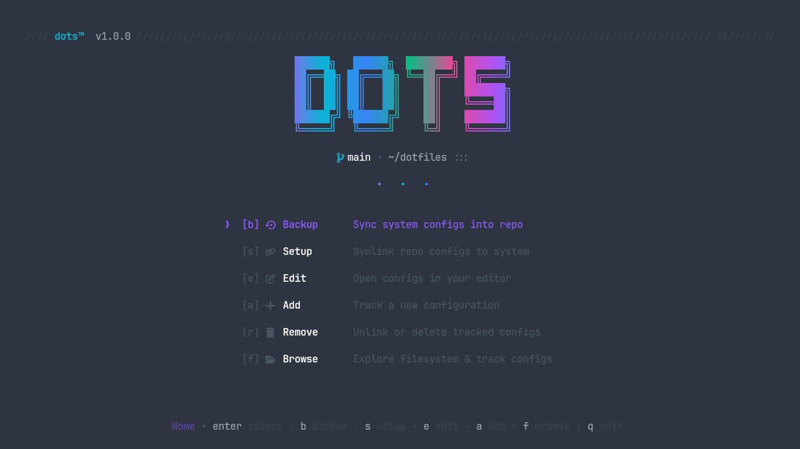

# dots

A beautiful, modern terminal user interface (TUI) and CLI tool for managing your
dotfiles. Built with [Charmbracelet](https://charm.sh) tools: [Bubble
Tea](https://github.com/charmbracelet/bubbletea),
[Bubbles](https://github.com/charmbracelet/bubbles), and [Lip
Gloss](https://github.com/charmbracelet/lipgloss).



---

## Features

- **Beautiful Terminal UI**: Clean typography, elegant borders, responsive
  layouts, and modern color palette.
- **Interactive Setup Wizard**: Initialize with an existing local repository or
  clone directly from GitHub/Git URLs with intelligent branch and ignore
  configuration (`dots init`).
- **Selective Backups**: Choose exactly which configurations to back up from
  your system into the repository, complete with streaming diff checks.
- **Selective Setup**: Safely symlink configs from your repo to your system,
  automatically archiving existing configs into collision-free timestamped
  backups.
- **Diff Previews**: Inspect colored, unified diffs before confirming any backup
  or setup operation.
- **Frictionless Editing**:
  - **Direct CLI**: Jump straight into editing any config: `dots edit nvim`,
    `dots edit tmux`, etc.
  - **Interactive TUI**: Browse configs with fuzzy search and open them in
    `$EDITOR`; resumes the TUI smoothly on exit.
- **Dynamic Discovery & Registration**: Automatically discover user configs from
  `$XDG_CONFIG_HOME` and `$HOME` or register custom paths manually (`dots add`).
- **Safe Removal**: Unlink system symlinks safely or remove files from the
  repository with automated git commits (`dots remove`).
- **Auto-Discovery & Refresh**: Scan repository entries against `.dotignore`
  rules and update tracked configs with one command (`dots refresh`).
- **Git Integration**: Interactive prompt to commit with timestamped metadata
  and push after changes.
- **Zero Hardcoding**: Clean, generic design that adapts to any system without
  assuming personal directory structures or application preferences.

---

## Installation

### 1. One-Line Shell Installer (Recommended)

Install the latest pre-compiled binary on Linux or macOS without needing Go or
build tools:

```bash
curl -fsSL https://raw.githubusercontent.com/BitwiseSang/dots/main/install.sh | bash
```

### 2. Pre-Compiled Binaries & Packages (.deb / .rpm)

Download standalone binaries, `.deb`, or `.rpm` packages for your platform from
the [GitHub Releases](https://github.com/BitwiseSang/dots/releases) page.

- **Linux (`amd64`, `arm64`)**: Standalone binary, Debian/Ubuntu (`.deb`), and
  Fedora/RHEL (`.rpm`)
- **macOS (`Apple Silicon`, `Intel`)**: Standalone binary

### 3. Using Go

If you have Go installed on your machine:

```bash
go install github.com/BitwiseSang/dots/cmd/dots@latest
```

### 4. Build from Source

```bash
git clone https://github.com/BitwiseSang/dots.git
cd dots
make install
```

This compiles the binary and installs it to `~/.local/bin/dots`. Ensure
`~/.local/bin` is in your `$PATH`.

---

## Usage

### Quick Start

On a fresh system or new installation, run the setup wizard:

```bash
dots init
```

The wizard will guide you through setting up or cloning your dotfiles
repository, selecting configurations, and setting `.dotignore` rules.

### Interactive TUI

Launch the full interactive dashboard:

```bash
dots
```

Jump directly to a specific view within the TUI:

```bash
dots backup   # Open backup view
dots setup    # Open setup view
dots edit     # Open edit menu
dots add      # Open add & discovery view
dots remove   # Open removal view
```

### Direct CLI Commands (Bypass TUI)

```bash
# Editing
dots edit <name>                   # Open config path directly in $EDITOR (e.g. dots edit nvim)

# Setup & Backup
dots setup --all                   # Symlink all tracked dotfiles
dots backup --all                  # Back up all tracked dotfiles into the repo

# Adding & Scanning
dots refresh                       # Scan repository for untracked configs and add them

# Removal
dots remove <name>                 # Interactive removal prompt
dots remove <name> --symlink-only  # Unlink system symlink only (keep repo files)
dots remove <name> --all -y        # Unlink symlink, delete from repo, and untrack
```

### Command-Line Flags

```bash
dots [command] [flags]

Flags:
  -e, --editor string   Editor command to use (overrides config and $EDITOR)
  -r, --repo string     Path to dotfiles repository (overrides config)
  -v, --version         Print version
  -h, --help            Show help
```

---

## Keybindings

### Global

- `q` / `Ctrl+C`: Quit
- `Esc`: Go back to previous view / menu

### Selection Views (Backup / Setup / Add)

- `↑` / `k`: Move up
- `↓` / `j`: Move down
- `Space`: Toggle selection of current item
- `a`: Select / deselect all items
- `/`: Filter / search list
- `Enter`: Proceed to preview / execute

### Diff Preview

- `↑` / `k`: Scroll up
- `↓` / `j`: Scroll down
- `Enter`: Confirm and execute
- `Esc`: Cancel and return to selection

---

## Configuration

Configuration is stored in `~/.config/dots/config.toml`:

```toml
# Editor command (falls back to $EDITOR, $VISUAL, or standard system editors)
editor = "nvim"

# Path to your dotfiles repository
repo_path = "~/dotfiles"

[git]
auto_commit = false     # Automatically commit on backup without prompt
auto_push = false       # Automatically push after commit
commit_prefix = ""      # Optional commit message prefix

# Tracked dotfile entries
[[dotfiles]]
name = "nvim"
repo_path = "nvim"
system_path = "~/.config/nvim"
method = "rsync"       # "copy" or "rsync"
is_dir = true

[[dotfiles]]
name = "tmux"
repo_path = "tmux.conf"
system_path = "~/.tmux.conf"
method = "copy"
is_dir = false
```

---

## Ignore Patterns (`.dotignore`)

Create a `.dotignore` file in your repository root to ignore non-dotfile files.
Sane defaults (`.git`, `README*`, `LICENSE*`, `Makefile*`, `bin/`, `build/`,
`dots`, `*.tar.gz`, etc.) are applied automatically.

You can add custom patterns or negate defaults using `!` (e.g. `!Makefile`).
