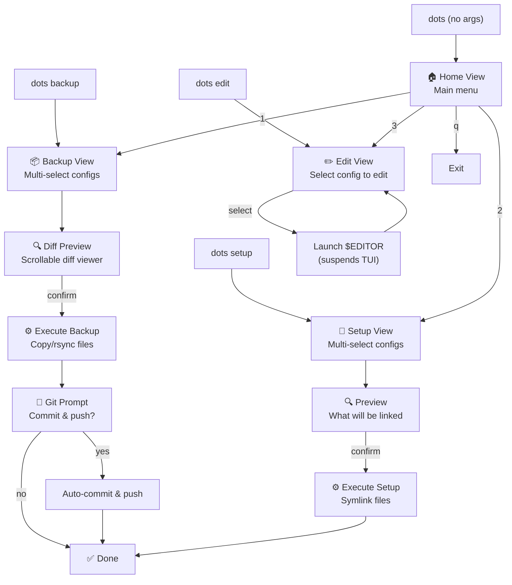

# `dots` — Architecture Plan

> A beautiful TUI for managing your dotfiles: selective backup, setup, editing, and diff previews.

---

## 1. CLI Interface

`dots` works in two modes: **interactive TUI** (no args) and **direct commands** (with args).

```
dots                          # Launch interactive TUI (main menu)
dots backup                   # TUI: jump straight to backup selection
dots setup                    # TUI: jump straight to setup selection
dots edit                     # TUI: jump straight to edit selection
dots edit <name>              # Direct: open config in editor immediately (no TUI)
dots edit nvim                # Example: opens ~/.config/nvim/ in $EDITOR
dots edit tmux                # Example: opens ~/.tmux.conf in $EDITOR
dots edit ghostty             # Example: opens ghostty config in $EDITOR
dots --help                   # Help text
dots --version                # Version
```

> [!TIP]
> `dots edit <name>` bypasses the TUI entirely — it resolves the config path and execs the editor directly. This is the "quick access from terminal" feature you asked for.

---

## 2. TUI Views & Navigation



### View Details

#### 🏠 Home View
- Centred logo/title rendered with lipgloss
- Vertical menu list using `bubbles/list` with styled item delegates
- Options: **Backup**, **Setup**, **Edit**, **Quit**
- Footer with keybinding help via `bubbles/help`

#### 📦 Backup View
- Multi-select checklist of all registered dotfile configs
- Each item shows: name, status indicator (✓ in-sync / ✗ changed / ? missing)
- `[space]` toggles selection, `[a]` toggles all, `[enter]` proceeds
- → Transitions to **Diff Preview** for selected items

#### 🔗 Setup View
- Multi-select checklist identical to Backup
- Each item shows: name, current state (🔗 linked / 📄 exists / ∅ missing)
- `[enter]` → Preview of what will be symlinked (source → dest)
- Confirm → executes symlink creation (with backup of existing files)

#### ✏️ Edit View
- Single-select list of configs
- Each item shows: name, path, type (file/directory)
- `[enter]` → suspends TUI, launches editor, resumes TUI on exit
- File configs open the specific file; directory configs open the directory

#### 🔍 Diff Preview
- `bubbles/viewport` displaying a colourized diff
- Scrollable, with line counts and file headers
- `[enter]` to confirm, `[esc]` to go back
- Additions in green, deletions in red, headers in blue

---

## 3. Project Structure

```
dotfiles/
└── dots/                          # ← Added to dotfiles/.gitignore
    ├── cmd/
    │   └── dots/
    │       └── main.go            # Entry point: CLI parsing → TUI or direct command
    ├── internal/
    │   ├── config/
    │   │   ├── config.go          # Config file loading, defaults, validation
    │   │   └── defaults.go        # Default dotfile registry (your current configs)
    │   ├── dotfile/
    │   │   ├── entry.go           # DotfileEntry type, path resolution
    │   │   ├── backup.go          # Backup operations (copy, rsync)
    │   │   ├── setup.go           # Setup operations (symlink, backup existing)
    │   │   └── diff.go            # Diff generation between source ↔ repo
    │   ├── git/
    │   │   └── git.go             # Git operations (status, add, commit, push)
    │   ├── editor/
    │   │   └── editor.go          # Editor resolution ($EDITOR / config) & launch
    │   └── ui/
    │       ├── app.go             # Root bubbletea Model, view routing, key dispatch
    │       ├── theme/
    │       │   └── theme.go       # Colour palette, reusable lipgloss styles
    │       ├── components/
    │       │   ├── header.go      # App header/logo with styled title
    │       │   ├── statusbar.go   # Bottom status bar (context, key hints)
    │       │   └── selector.go    # Reusable multi-select list (wraps bubbles/list)
    │       └── views/
    │           ├── home.go        # Home menu model
    │           ├── backup.go      # Backup selection + execution model
    │           ├── setup.go       # Setup selection + execution model
    │           ├── edit.go        # Edit selection model
    │           └── diffview.go    # Diff preview viewport model
    ├── go.mod
    ├── go.sum
    ├── .gitignore                 # Ignores binary, vendor, etc.
    ├── Makefile                   # Build, install, clean targets
    └── README.md
```

---

## 4. Data Model

### DotfileEntry

The core abstraction — represents a single managed config:

```go
type SyncMethod int

const (
    SyncCopy  SyncMethod = iota // Single file: cp
    SyncRsync                   // Directory: rsync -a --delete
)

type DotfileEntry struct {
    Name       string     // Display name: "nvim", "tmux", "ghostty", etc.
    RepoPath   string     // Relative path within dotfiles repo: "nvim", "tmux/tmux.conf"
    SystemPath string     // Absolute path on system: "~/.config/nvim", "~/.tmux.conf"
    AltPaths   []string   // Fallback system paths (ghostty, aria2)
    Method     SyncMethod // Copy or Rsync
    IsDir      bool       // Whether this is a directory config
}
```

### Default Registry

Hardcoded from your current `backup.sh` / `setup.sh`, overridable via config:

| Name | Repo Path | System Path | Alt Paths | Method | IsDir |
|------|-----------|-------------|-----------|--------|-------|
| ghostty | `ghostty/config.ghostty` | `~/.config/ghostty/config` | `~/.config/ghostty/config.ghostty` | Copy | No |
| kitty | `kitty/kitty.conf` | `~/.config/kitty/kitty.conf` | — | Copy | No |
| tmux | `tmux/tmux.conf` | `~/.tmux.conf` | — | Copy | No |
| clang-format | `clang-format/.clang-format` | `~/.clang-format` | — | Copy | No |
| aria2 | `aria2/aria2.conf` | `~/.config/aria2/aria2.conf` | `~/aria2.conf` | Copy | No |
| nvim | `nvim` | `~/.config/nvim` | — | Rsync | Yes |
| doom | `doom` | `~/.config/doom` | — | Rsync | Yes |
| fish | `fish` | `~/.config/fish` | — | Rsync | Yes |

---

## 5. Config File

Location: `~/.config/dots/config.toml`

```toml
# Editor to use for editing dotfiles
# Respects $EDITOR env var as fallback
editor = "nvim"

# Path to the dotfiles repository
repo_path = "~/Documents/dotfiles"

# Git settings
[git]
auto_commit = false     # If true, skip the interactive git prompt
auto_push = false       # If true, push after commit automatically
commit_prefix = ""      # Optional prefix for commit messages

# Custom dotfile entries (extends the built-in registry)
# Uncomment and modify to add your own:
#
# [[dotfiles]]
# name = "hyprland"
# repo_path = "hyprland"
# system_path = "~/.config/hypr"
# method = "rsync"       # "copy" or "rsync"
# is_dir = true
```

The config file is **optional** — sensible defaults work out of the box. Created on first run if it doesn't exist.

---

## 6. Library Stack

| Library | Version | Import Path | Purpose |
|---------|---------|-------------|---------|
| **bubbletea** | v2 | `charm.land/bubbletea/v2` | TUI framework (Elm architecture) |
| **bubbles** | v2 | `charm.land/bubbles/v2/*` | Components: list, viewport, spinner, help, key |
| **lipgloss** | v2 | `charm.land/lipgloss/v2` | Styling, layout, borders, colours |
| **huh** | v2 | `charm.land/huh/v2` | Confirm prompts (git commit y/n) |
| **log** | v2 | `charm.land/log/v2` | Styled terminal logging (non-TUI output) |
| **cobra** | — | `github.com/spf13/cobra` | CLI arg parsing (subcommands, flags) |
| **go-toml** | — | `github.com/pelletier/go-toml/v2` | Config file parsing |

> [!NOTE]
> If the v2 vanity imports (`charm.land/...`) cause issues during `go mod tidy`, we'll fall back to the `github.com/charmbracelet/...` v1 paths which are stable and well-documented. The architecture is the same either way.

---

## 7. Visual Design

### Colour Palette

A custom palette designed for dark terminals — rich and modern without being tied to a specific theme:

```
Primary     #7C3AED  (violet)     — headers, selected items, active borders
Secondary   #06B6D4  (cyan)       — secondary highlights, status indicators
Accent      #F59E0B  (amber)      — warnings, attention markers
Success     #10B981  (emerald)    — success states, additions in diffs
Error       #EF4444  (red)        — errors, deletions in diffs
Muted       #6B7280  (gray)       — disabled items, secondary text
Surface     #1F2937  (dark gray)  — card backgrounds, borders
Text        #F9FAFB  (off-white)  — primary text
Subtle      #9CA3AF  (mid-gray)   — descriptions, help text
```

### Layout Principles

- **Consistent framing**: Every view has a styled header + status bar footer
- **Rounded borders** on content panels (`lipgloss.RoundedBorder()`)
- **Generous padding**: 1-2 cells padding inside panels, no cramped text
- **Aligned columns**: Names and paths aligned in selection lists
- **Smooth transitions**: Spinner animations during operations
- **Status indicators**: Unicode symbols (✓ ✗ 🔗 📄 ∅) for at-a-glance state

### Logo / Header

```
     ·  ·
  ╺━━━━━━━╸
    d o t s
  ╺━━━━━━━╸
     ·  ·
```

A minimal, styled ASCII header rendered with lipgloss — shown on the home view.

---

## 8. Key Interactions & Keybindings

### Global
| Key | Action |
|-----|--------|
| `q` / `ctrl+c` | Quit |
| `esc` | Back to previous view |
| `?` | Toggle help |

### Selection Views (Backup / Setup)
| Key | Action |
|-----|--------|
| `↑/k` | Move up |
| `↓/j` | Move down |
| `space` | Toggle item selection |
| `a` | Toggle all |
| `enter` | Proceed with selected |
| `/` | Filter items |

### Diff Preview
| Key | Action |
|-----|--------|
| `↑/k` | Scroll up |
| `↓/j` | Scroll down |
| `enter` | Confirm & execute |
| `esc` | Cancel & go back |

---

## 9. Implementation Phases

### Phase 1 — Foundation
- [ ] Project scaffold: `go.mod`, directory structure, Makefile
- [ ] Config file loading with defaults
- [ ] DotfileEntry registry and path resolution
- [ ] CLI parsing with cobra (subcommands: `backup`, `setup`, `edit`)
- [ ] Theme and base lipgloss styles
- [ ] `git init` + initial conventional commit

### Phase 2 — Edit Feature
- [ ] Edit view: single-select list of configs
- [ ] Editor resolution (`$EDITOR` → config → `nvim`)
- [ ] Editor launch (suspend TUI, exec editor, resume)
- [ ] Direct `dots edit <name>` CLI path (no TUI)

### Phase 3 — Backup Feature
- [ ] Backup view: multi-select with status indicators
- [ ] Diff generation (compare system ↔ repo)
- [ ] Diff preview viewport with syntax coloring
- [ ] Backup execution (safe_copy / rsync mirroring backup.sh)
- [ ] Git operations: status check, add, commit, push
- [ ] Interactive git prompt via huh confirm

### Phase 4 — Setup Feature
- [ ] Setup view: multi-select with state indicators
- [ ] Preview: show what will be linked (source → dest)
- [ ] Setup execution (symlink creation mirroring setup.sh)
- [ ] Existing config backup to timestamped directory

### Phase 5 — Polish
- [ ] Logo/header component
- [ ] Status bar with context-aware hints
- [ ] Error handling and styled error display
- [ ] Loading spinners during operations
- [ ] README.md for the dots project
- [ ] `make install` target (copies binary to `~/.local/bin`)

---

## 10. Conventional Commits Plan

Every phase will produce commits following the convention:

```
feat: scaffold project structure with go.mod and directory layout
feat(config): add TOML config loading with sensible defaults
feat(dotfile): add entry registry with path resolution
feat(cli): add cobra CLI with backup/setup/edit subcommands
feat(ui): add theme package with colour palette and base styles
feat(ui): add home view with main menu
feat(edit): add edit view with editor launch
feat(edit): add direct edit via CLI args
feat(backup): add backup selection view with status indicators
feat(backup): add diff generation and preview viewport
feat(backup): add backup execution with copy and rsync
feat(git): add interactive commit and push prompt
feat(setup): add setup selection view with state indicators
feat(setup): add setup execution with symlink creation
style(ui): add logo header and status bar polish
chore: add Makefile with build and install targets
docs: add README with usage and configuration guide
```
