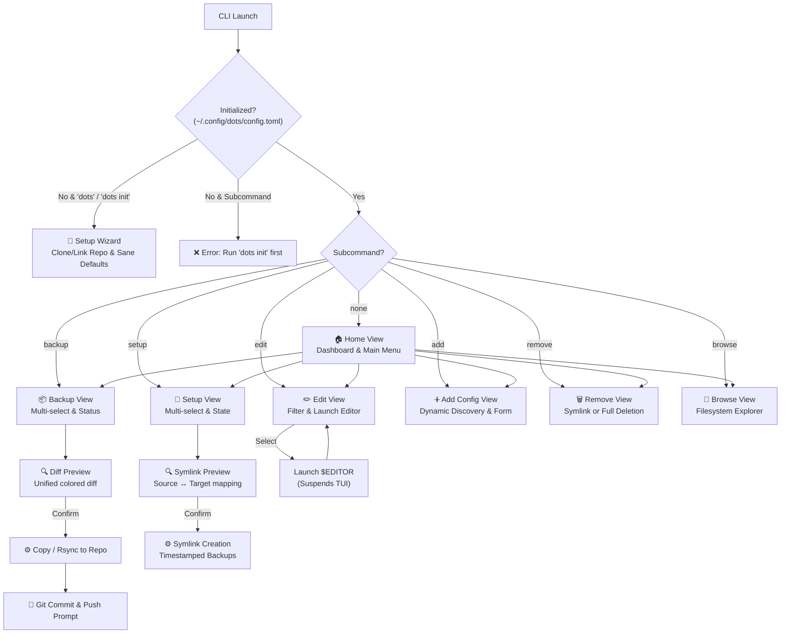

# `dots` — Architecture & Design Specification

> A modern, universal Terminal User Interface (TUI) and CLI tool for managing, synchronizing, and editing dotfiles across Unix systems.

---

## 1. Overview & Core Philosophy

`dots` is designed as a standalone, multi-user dotfile manager suitable for any Linux or macOS environment. It treats user configuration repositories agnostically, enforcing clean separation of concerns and zero personal hardcoding:

- **Strict Initialization Guard**: `dots` does not inject fake or arbitrary defaults. On an uninitialized system, running direct subcommands safely alerts the user to run `dots init`, while bare execution launches the interactive setup wizard.
- **Dynamic Configuration Discovery**: Discovers existing user configurations dynamically from `$XDG_CONFIG_HOME` (default `~/.config`) and `$HOME` without assuming specific desktop environments or editors.
- **Atomic & Safe Filesystem Operations**: All configuration and ignore file saves employ write-to-temp and atomic rename patterns (`os.Rename`). Setup backups preserve relative path hierarchies and use high-resolution timestamps to eliminate basename collisions.
- **Streaming Diffs & Memory Efficiency**: Directory comparisons stream chunks up to 32KB rather than buffering entire files into memory.

---

## 2. CLI Interface

`dots` operates in two primary modes: **interactive TUI** and **direct CLI commands**.

```bash
# Setup & Initialization
dots                           # Launch TUI (runs setup wizard if uninitialized)
dots init                      # Launch interactive repository setup wizard

# Main Workflows
dots setup                     # TUI: select and symlink repository configs to system
dots setup --all               # Direct: symlink all configs without TUI
dots backup                    # TUI: select and copy system configs into repository
dots backup --all              # Direct: backup all configs without TUI
dots edit                      # TUI: select config to edit from interactive list
dots edit <name>               # Direct: open config path in $EDITOR immediately
dots add                       # TUI: discover or manually register new configs
dots remove                    # TUI: interactive configuration removal
dots remove <name> [flags]     # Direct: remove/unlink specified configuration
dots refresh                   # Direct: scan repository and track newly found configs

# Global Flags
  -e, --editor string          # Override editor command
  -r, --repo string            # Override repository path
  -v, --version                # Display version
  -h, --help                   # Display help information
```

---

## 3. TUI Architecture & Flow



---

## 4. Project Structure

```
dots/
├── cmd/
│   └── dots/
│       ├── main.go               # Entrypoint: flag parsing, init guard, command dispatch
│       └── main_test.go          # CLI & initialization unit tests
├── internal/
│   ├── config/
│   │   ├── config.go             # TOML configuration loading, saving, validation
│   │   ├── defaults.go           # Sane fallback config specifications
│   │   └── config_test.go        # Config unit tests
│   ├── dotfile/
│   │   ├── entry.go              # Dotfile Entry struct, relative symlink resolution, streaming equality
│   │   ├── backup.go             # Safe copy, rsync fallback, atomic writes
│   │   ├── setup.go              # Symlink setup, hierarchical collision-free backups
│   │   ├── diff.go               # Unified diff generator & exit code handling
│   │   ├── discover.go           # Dynamic discovery from $XDG_CONFIG_HOME and $HOME
│   │   ├── ignore.go             # .dotignore manager, sane defaults, glob matching
│   │   ├── repo_scan.go          # Repository scanner, flexible spec inference, database refresh
│   │   ├── remove.go             # Configuration unlinking, repository deletion, git staging
│   │   └── *_test.go             # Comprehensive dotfile package unit tests
│   ├── git/
│   │   ├── git.go                # Git command wrappers (status, add, commit, push)
│   │   ├── remote.go             # Remote repository URL parser & clone target resolution
│   │   └── remote_test.go        # Remote cloning unit tests
│   ├── editor/
│   │   └── editor.go             # Editor resolution ($EDITOR, $VISUAL, PATH lookup)
│   └── ui/
│       ├── app.go                # Root Bubble Tea model, view routing, transition animation
│       ├── theme/
│       │   └── theme.go          # Consistent lipgloss palette, typography, file icons
│       ├── components/
│       │   ├── header.go         # Responsive header with repo status and breadcrumbs
│       │   ├── statusbar.go      # Sticky bottom status bar with navigation shortcuts
│       │   └── selector.go       # Searchable, filterable multi-select list component
│       └── views/
│           ├── home.go           # Main dashboard and navigation
│           ├── backup.go         # Backup selection and execution
│           ├── setup.go          # Symlink setup and verification
│           ├── edit.go           # Config list filtering and editor execution
│           ├── browse.go         # In-TUI filesystem browser
│           ├── add_config.go     # Dynamic system config discovery and manual registration
│           ├── remove.go         # Safe unlinking and repository cleanup
│           ├── diffview.go       # Scrollable diff viewer
│           └── wizard.go         # First-time interactive setup wizard
├── Makefile                      # Build, test, and install automation
└── go.mod
```

---

## 5. Data Model & Configuration

### Data Structures

```go
type DotfileSpec struct {
    Name       string   `toml:"name"`        // Identifier: "nvim", "tmux", "alacritty"
    RepoPath   string   `toml:"repo_path"`   // Relative path within repository
    SystemPath string   `toml:"system_path"` // Target system path (~/.config/nvim, ~/.tmux.conf)
    AltPaths   []string `toml:"alt_paths"`   // Alternative fallback system paths
    Method     string   `toml:"method"`      // "copy" (file) or "rsync" (directory)
    IsDir      bool     `toml:"is_dir"`      // File or directory indicator
}
```

### Configuration File (`~/.config/dots/config.toml`)

```toml
# Editor command (falls back to $EDITOR, $VISUAL, or standard system editors)
editor = "nvim"

# Absolute path to dotfiles repository
repo_path = "~/dotfiles"

[git]
auto_commit = false      # Automatically commit after backup without prompting
auto_push = false        # Automatically push commits to remote
commit_prefix = ""       # Optional prefix for commit messages

# Tracked dotfile configurations
[[dotfiles]]
name = "nvim"
repo_path = "nvim"
system_path = "~/.config/nvim"
method = "rsync"
is_dir = true

[[dotfiles]]
name = "tmux"
repo_path = "tmux.conf"
system_path = "~/.tmux.conf"
method = "copy"
is_dir = false
```

---

## 6. Sane Ignore Defaults (`.dotignore`)

Repositories may contain documentation, build artifacts, and development metadata that should not be symlinked to the system. `dots` provides sane defaults:

```
.git
.git*
.github
.dotignore
README*
LICENSE*
LICENCE*
Makefile*
Dockerfile*
go.mod
go.sum
bin/
build/
dots
*.tar.gz
*.bak
```

Users can customize rules in `<repo>/.dotignore`, including negations (e.g. `!Makefile` or `!bin/`).
